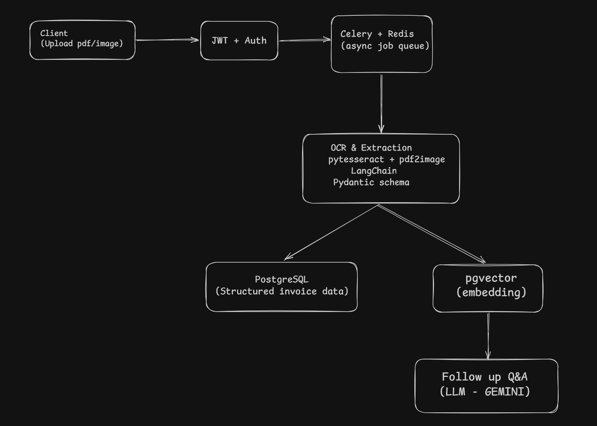

# Docstruct

DocStruct extracts structured data from invoices (PDF/image) using OCR and a predefined schema, then embeds the results to support natural-language follow-up questions - turning unstructured documents into a queryable knowledge base.
Built with tesseract for OCR and pgvector for Q&A.

## Features

- Upload invoices as PDF or image - no need to convert files beforehand
- Text extraction (OCR) - pulls raw text from scanned or photographed invoices
- Structured data extraction - extracts key invoice fields (invoice number, date, vendor, line items, total, etc.) into a clean, predefined schema
- Ask follow-up questions - query invoices in natural language (e.g. "What's the total due?", "Who's the vendor?") and get context-grounded answers
- Secure, authenticated API - JWT-based auth protects invoice data end-to-end

## Tech Stack

- Django REST Framework
- JWT
- Pytesseract
- PostgreSQL + pgvector
- Redis
- Celery
- LangChain/LangGraph
- Gemini
- pydantic
- AWS S3
- Docker

## Architecture



## Project Structure

```text
docstruct/
├── docstruct/                    
│   ├── __init__.py
│   ├── asgi.py
│   ├── settings.py                
│   ├── urls.py                    # Root URL config
│   └── wsgi.py
│
├── document_processing/           # Core document processing app
│   ├── migrations/
│   ├── embedding.py               # Generate document embeddings
│   ├── llm.py                     # LLM integration (Gemini)
│   ├── models.py                  # Document model
│   ├── ocr.py                     # OCR utilities
│   ├── serializers.py             # Document serializers
│   ├── storage.py                 # AWS S3 storage configuration
│   ├── tasks.py                   # Celery background tasks
│   ├── urls.py                    
│   ├── vector_store.py            # pgvector initialization
│   └── views.py                   # Invoice related endpoints
│
├── users/                         # User authentication app
│   ├── migrations/
│   ├── models.py                  # Custom User model
│   ├── serializer.py              # Authentication serializers
│   ├── urls.py                    
│   └── views.py                   # Register/Login APIs
│
├── Dockerfile                     
├── docker-compose.yaml            
├── requirements.txt               
├── manage.py                      
├── README.md
└── .gitignore
```

## Prerequisites

- **Windows/macOS:** Install Docker Desktop.
- **Linux:** Install Docker Engine and Docker Compose.
- Git
- Postman/Insomnia/Any kind of http client

## Environment Variables

Create a `.env` file in the project root and add the following variables:

```env
DATABASE_DB=docstructdb
DATABASE_USERNAME=postgres
DATABASE_PASSWORD=postgres
DATABASE_HOST=postgres

AWS_ACCESS_KEY_ID=<YOUR_AWS_ACCESS_KEY_ID>
AWS_SECRET_ACCESS_KEY=<YOUR_AWS_SECRET_ACCESS_KEY>
AWS_STORAGE_BUCKET_NAME=<YOUR_S3_BUCKET_NAME>
AWS_S3_SIGNATURE_NAME=<YOUR_S3_SIGNATURE_NAME>
AWS_S3_REGION_NAME=<YOUR_S3_REGION_NAME>

GEMINI_API_KEY=<YOUR_GEMINI_API_KEY>
GOOGLE_API_KEY=<SAME_AS_GEMINI_API_KEY>

SECRET_KEY=<GENERATE_A_RANDOM_SECRET_KEY>

ALLOWED_HOSTS=localhost,127.0.0.1
```

## Installation & Setup

### 1. Clone the Repository

```bash
git clone https://github.com/isouvikdas/Docstruct.git
cd docstruct
```

### 2. Create the Environment File

Create a `.env` file in the project root and add the required environment variables as described above.

### 3. Build the Docker Images

```bash
docker compose build
```

### 4. Start the Services

```bash
docker compose up
```

To run the containers in detached mode:

```bash
docker compose up -d
```

### 5. Apply Database Migrations

Open a new terminal and run:

```bash
docker compose exec web python manage.py migrate
```

### 6. Create a Superuser (Optional)

```bash
docker compose exec web python manage.py createsuperuser
```

### Stopping the Application

```bash
docker compose down
```

## API Endpoints & Flow

Base URL:

```
http://localhost:8000/api/
```

### 1. Register

```text
POST /auth/register/user
# Body
{
    "username": "...", # unique
    "email": "...",
    "password": "...",
    "role": "USER"
}
```

### 2. Login

```text
# Access token is valid for 30 mins
POST /auth/login/ 
```

Returns

```json
{
    "access": "...",
    "refresh": "..."
}
```

### 3. Upload a Document

```text
POST /document/upload
Authorization: Bearer <access_token>
accepts the file with key: file
```

Returns

```json
{
    "id": "...",
    "status": "PENDING",
    "extracted_data": null,
    "error_text": null,
    "is_embedded": "False"
}
```

Celery processes the document

```
PENDING -> PROCESSING -> COMPLETED

# Check the status
GET /document/status/<id>
Authorization: Bearer <access_token>
```

### 4. Ask Questions

```text
POST /chat/
# If not the doc_id include the filename of the invoice in the query.
```

Example

```json
{
    "doc_id": "...",
    "query": "Summarize this invoice."
}
```

## Future Improvements

- [ ] Add unit and integration tests
- [ ] API rate limiting to prevent upload abuse
- [ ] Real-time task progress using Server-Sent Events (so users know when OCR is done)
- [ ] File validation & stricter upload policies (file type checks, size limits, malware scanning)
- [ ] CI/CD pipeline with GitHub Actions (lint, test, deploy on push)
- [ ] Hybrid search (keyword + vector) for better Q&A retrieval accuracy


